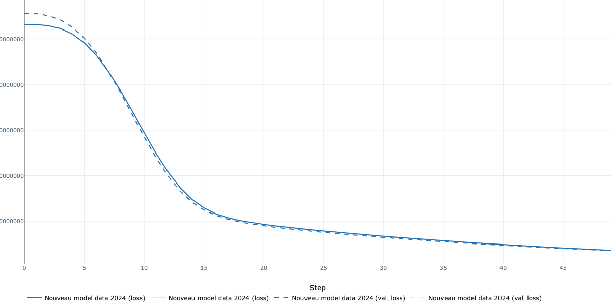
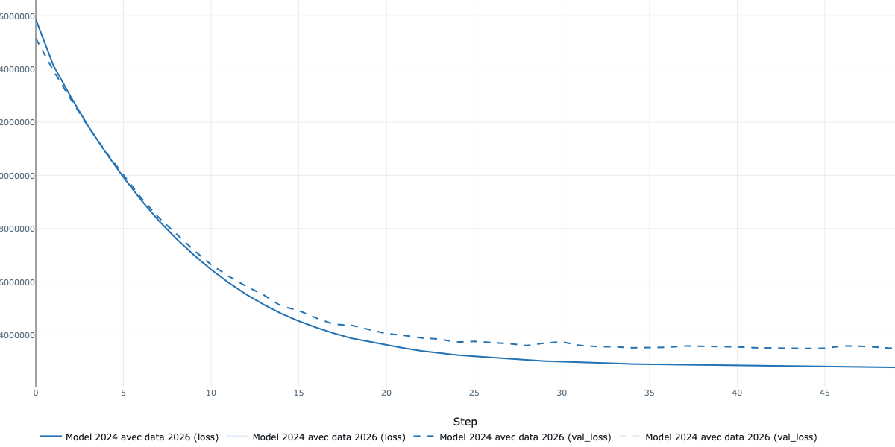
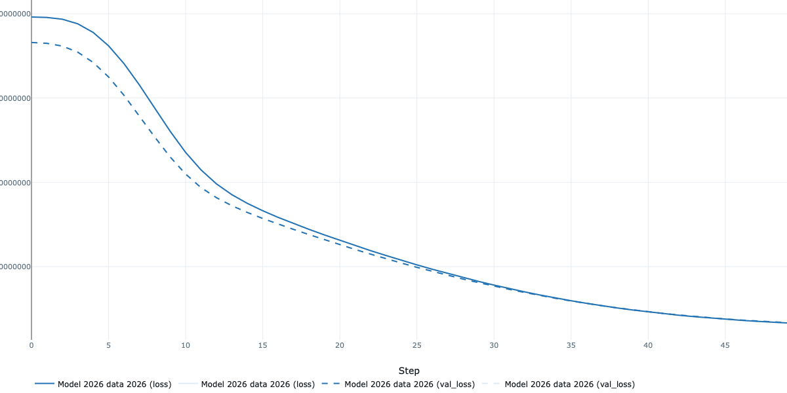

# TODO
- 1.a: re-cree le model 2024 a partir des data de 2024
- 1.b: evaluer le model de 2024 avec les data de 2026
- 2: re-entrainer le model de 2024 a partir des data de 2026
- 3.a cree un nouveau model a partor des data de 2026
- 3.b mesurer les performances du model de 2026 avec les data de 2024

## 1a Nouveau model data 2024

- MSE = 35266716.0532141
- MAE = 4840.611357181178
- R² = 0.7597057125555016

## 1b evaluer le model de 2024 avec les data de 2026

- MSE = 28077808.35462327
- MAE = 3970.1081623236637
- R² = 0.7406260903302313

## 2 re-entrainer le model de 2024 a partir des data de 2026

- MSE = 13487075.380310329
- MAE = 2396.67724944394
- R² = 0.8754106649913805

## 3a cree un nouveau model a partir des data de 2026

- MSE = 16762973.532187695
- MAE = 2848.961247606529
- R² = 0.8451489543692089

## 3b mesurer les performances du model de 2026 avec les data de 2024

- MSE = 29159882.28337352
- MAE = 4353.845495522567
- R² = 0.8013154067229886

