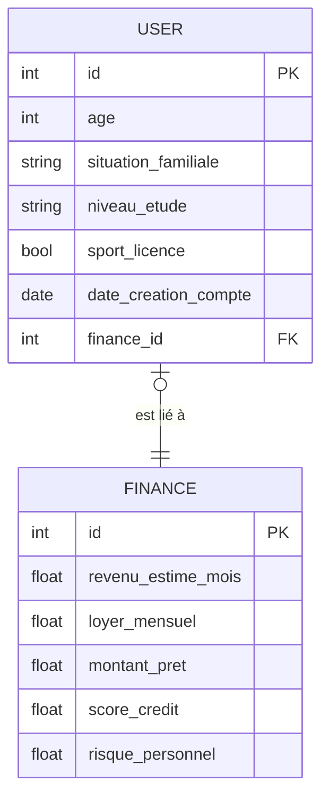
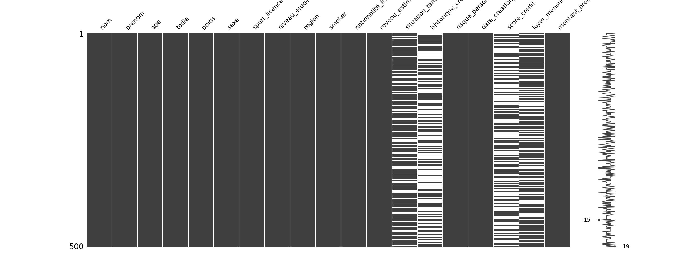
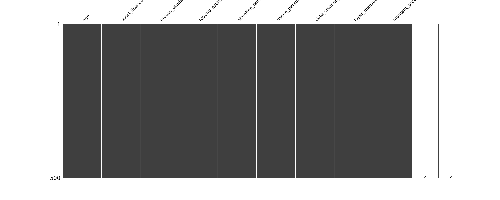
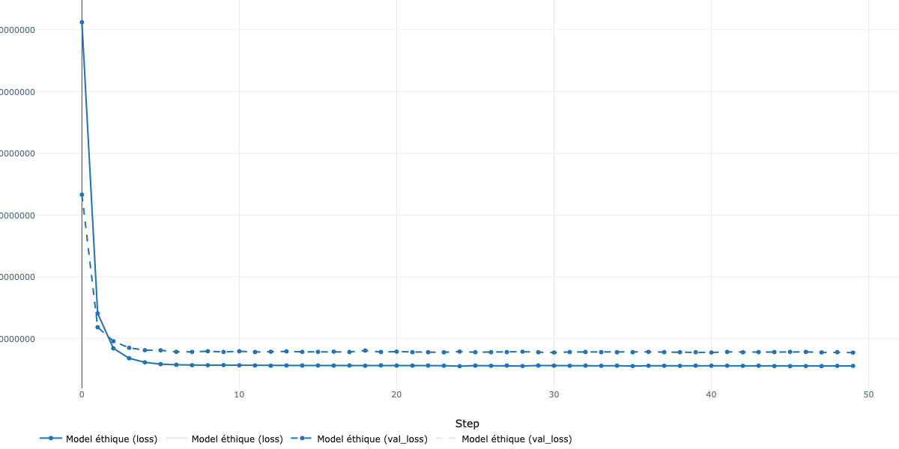

# Todo
- [x] Un dossier de projet contenant les modèles ORM en Python
- [x] Un script de création de base de données initiale (option : migration Alembic)
- [x] Une API FastAPI exposant au moins 3 routes utiles (GET / POST / DELETE)
- [x] Un fichier README expliquant la structure et le déploiement de l'API
- [x] Une image de la loss de training et de validation liée à l'entrainement du modèle

# Prérequis
## Configuration de l'environnement virtuel
`python3 -m venv .venv && source .venv/bin/activate`
## Installer les dépendances
`pip install --upgrade pip && pip install -r requirements.txt`

# 0. Architecture des Données (MERISE)

Le modèle de données suit les principes de séparation des préoccupations. Les informations personnelles sont isolées des métriques financières.

**Note sur l'architecture** : Bien qu'une relation de `0:1` puisse suggérer une fusion des données dans une table unique pour optimiser les performances, j'ai choisi de séparer les entités USER et FINANCE conformément au principe de Séparation des Préoccupations (SoC). Cette approche facilite la maintenance, permet une meilleure gestion de la confidentialité des données (RGPD) et rend le modèle plus évolutif pour de futurs besoins métier.



# 1. Pipeline de Préparation
 - Suppression des variables sensibles (RGPD) et non-pertinentes pour garantir un modèle de scoring équitable et sans biais.
 - Traitement rigoureux du dataset original :
 - iltrage : Suppression des colonnes vides (>50%) et des lignes incomplètes (2% du dataset).
 - Application des regles metiers pour detecter les valeurs impossible
 - Outliers : Détection via la méthode de l'Interquartile Range (IQR) pour detecter les valeurs incoherentes.
 - Imputation : Remplissage des valeurs manquantes via l'algorithme KNN (K-Nearest Neighbors).

 
 *CSV avant nettoyage*

 *CSV après nettoyage*
# 2. Initialisation de l'Infrastructure
Lancement de l'instance PostgreSQL: `docker compose up -d`

# 3. Création des tables via SQLAlchemy.
`python init_db.py`

# 4.Migration & Seeding : Transfert des données du CSV nettoyé vers PostgreSQL.
`python migration.py`

# 4. Entraînement (train.py)
`python train.py`
Le modèle est un Réseau de Neurones (MLP) entraîné sur les données extraites directement de la base de données.

# 5. Déploiement de l'API

L'API FastAPI expose les données et le modèle pour une utilisation en temps réel.

`python -m uvicorn app.main:app --reload`

## Routes disponibles :

- GET /clients : Récupère la liste des profils en base.

`curl -X 'GET' 'http://127.0.0.1:9000/users/{id}' -H 'accept: application/json'`

resultat:
```json
{
  "situation_familiale": "veuf",
  "age": 19,
  "date_creation_compte": "2021-04-04",
  "id": 1,
  "niveau_etude": "bac",
  "sport_licence": false,
  "finance_id": 2,
  "finance": {
    "revenu_estime_mois": 4958,
    "montant_pret": 500,
    "risque_personnel": 0.19,
    "loyer_mensuel": 2522.306,
    "id": 2,
    "score_credit": null
  }
}
```

- DELETE /client/{id} : Supprime un enregistrement de la base de données.

`curl -X 'DELETE' 'http://127.0.0.1:9000/users/1' -H 'accept: application/json'`

resultat:
```json
{
  "message": "User 1 deleted successfully"
}
```

On verifie avec un GET:
`curl -X 'GET' 'http://127.0.0.1:9000/users/1' -H 'accept: application/json'`

resultat :

```json
{
  "detail": "User not found"
}
```

- POST /predict : Reçoit un JSON, applique le preprocessor.pkl et retourne le score via le modèle.

```bash
curl -X 'POST' \
  'http://127.0.0.1:9000/users/' \
  -H 'accept: application/json' \
  -H 'Content-Type: application/json' \
  -d '{
  "age": 19,
  "situation_familiale": "veuf",
  "niveau_etude": "bac",
  "sport_licence": false,
  "finance": {
    "revenu_estime_mois": 4958.0,
    "loyer_mensuel": 2522.31,
    "montant_pret": 500.0,
    "score_credit": 0.5
  }
}'
```

resultat:
```bash
{
  "status": "success",
  "message": "Utilisateur et profil financier créés",
  "user_id": 9801
}
```

# Annexe : Courbe de Performance (Loss)



*Image générée via MLflow Autolog*
