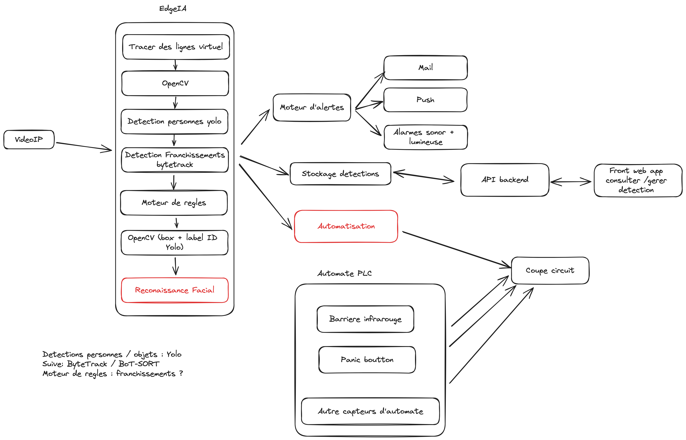

# Prévention des franchissements de zones dangereuses par vision IA

**Client :** directeur de production, site industriel (~150 personnes) — presse hydraulique, bras robotisés.
**Besoin :**
- alerter en temps réel quand un opérateur franchit une zone dangereuse (lignes au sol jaune/noir), avec notification mobile + clip vidéo.
- Identification.
**Objectif :**
- Réduire le risque prevenir les accidents

# Critères de succès
- Détecter les vrais franchissements (peu de faux négatifs)
- Latence « temps réel »
- Chaque alerte = un clip vidéo traçable.

# Architecture

## Pipeline (Phase 1)
`VideoIP → OpenCV (lecture frame) → YOLO (détection personnes) → ByteTrack (suivi + IDs) → Moteur de règles (franchissement ? ← zones virtuelles, en config) → OpenCV (box + label « personne #ID » + clip) → sorties`

Sorties : moteur d'alertes (mail / push / alarme sonore + lumineuse) · stockage des détections (rétention limitée).

- **OpenCV** = plomberie (lecture flux, géométrie des lignes, annotation, clip).
- **YOLO** = détecte et classe (personne vs objet).
- **ByteTrack / BoT-SORT** = suivi dans le temps (ID stable).
- **Moteur de règles** = logique maison déterministe qui décide le franchissement (transparent, auditable).

# Justifications
- Edge / sur site → faible latence, le flux vidéo ne sort pas du site.

## Approche par phases
- **Phase 1 — MVP, anonyme :** détection de franchissement + alerte + clip. Couvre l'essentiel du besoin, risque juridique maîtrisé.
- **Phase 2 — à challenger :** identification ? Contre-indication RGPD
- **Phase 3 — à challenger :** Coupe circuit basé sur la detection IA. S'assurer de la conformiter ISO des circuits de commandes et de protections.

## RGPD
- Biometrie : redflag

